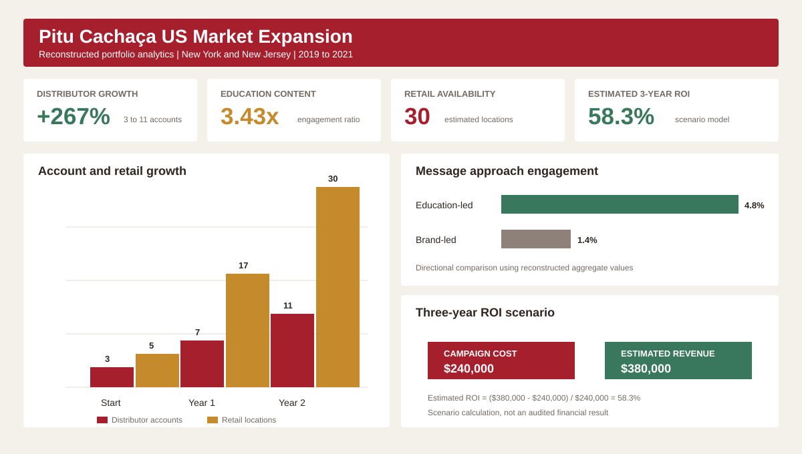

# Pitu Cachaça US Market Expansion Analytics

## Executive summary

This portfolio case study examines a market-entry campaign for Pitu Cachaça in New York and New Jersey from 2019 to 2021. The strategy addressed a product-education problem: many target consumers understood rum and tequila but did not know cachaça or how to use it.

The campaign led with the caipirinha, then connected the cocktail to the product. It combined consumer education, social content, influencer partnerships, retail tastings, distributor outreach, and monthly performance reviews.

The public datasets are reconstructed from campaign methodology and reported aggregate outcomes. Original client records remain confidential.



## Business question

How should an unfamiliar beverage brand build consumer demand and distributor confidence when entering a new market?

## My role

Campaign strategist and market-development lead at EPL Marketing Solutions.

I worked with the marketing team to identify the awareness barrier, define audience segments, develop the education-led campaign, coordinate activations, and review performance.

## Strategy

### Consumer education

The campaign introduced the caipirinha before asking audiences to recognize the Pitu brand. English-language recipes, tastings, and creator content explained how consumers should use the product.

### B2B and B2C coordination

Consumer demand alone would not place the product on shelves. Distributor and retail outreach ran alongside social and event activity. Buyers received evidence of consumer interest and materials that supported in-store education.

### Monthly optimization

Performance reviews compared content engagement, account growth, and retail availability. The team adjusted creators, recipes, and activation formats during the campaign.

## Reconstructed performance summary

| Metric | Starting point | Campaign outcome | Change |
| --- | ---: | ---: | ---: |
| Active distributor accounts | 3 | 11 | +266.7% |
| Retail locations stocking Pitu | About 5 | About 30 | +25 locations |
| Education-led content engagement | 1.2% baseline | 4.8% | +3.6 percentage points |
| Comparison content engagement | 1.2% baseline | 1.4% | +0.2 percentage points |
| Campaign investment | $0 | $240,000 | 24 months |
| Estimated discounted three-year revenue | $0 | $380,000 | Portfolio estimate |
| Estimated three-year ROI | Not applicable | 58.3% | Revenue less cost, divided by cost |

## Key insights

### Product education reduced the awareness barrier

Education-led content reached a 4.8% reconstructed engagement rate compared with 1.4% for the comparison content. The relative engagement ratio was 3.43 times.

### Consumer demand supported sales conversations

Social engagement and retail tastings gave distributors evidence that the product had an audience. Distributor accounts increased from 3 to 11 in the reconstructed campaign record.

### Shelf presence was the correct early market-entry metric

Immediate revenue alone would understate progress for an unfamiliar product. Distribution and retail availability measured whether the market infrastructure was developing.

### ROI depended on a multi-year view

The campaign required $240,000 across 24 months. Using an estimated discounted three-year revenue of $380,000 produces an estimated ROI of 58.3%. This is a scenario calculation, not an audited financial statement.

## Metric definitions

```text
Distributor growth = (11 - 3) / 3 = 266.7%
Engagement ratio = 4.8 / 1.4 = 3.43x
Estimated ROI = (380,000 - 240,000) / 240,000 = 58.3%
```

## Repository structure

```text
.
├── assets/
│   └── pitu-market-expansion-dashboard.svg
├── data/
│   ├── audience_test.csv
│   ├── campaign_summary.csv
│   ├── distributor_growth.csv
│   └── roi_inputs.csv
├── docs/
│   ├── data_dictionary.md
│   └── methodology.md
├── sql/
│   └── campaign_analysis.sql
└── src/
    └── analyze.py
```

## Run the analysis

The validation script uses Python 3.10 or later and the standard library.

```bash
python src/analyze.py
```

## Skills demonstrated

- Market-entry analysis
- B2B and B2C audience segmentation
- Campaign hypothesis design
- Marketing funnel analysis
- Distributor and retail performance measurement
- ROI scenario modelling
- Stakeholder communication
- Confidential-data handling

## Lessons for marketers

- Teach the use case before promoting an unfamiliar product name.
- Align consumer marketing with distributor and retail activation.
- Select metrics that match the stage of market development.
- State assumptions beside every ROI model.
- Separate measured outcomes from reconstructed scenarios.

## Data ethics

This repository contains no confidential client records, personal data, contracts, or platform exports. Figures are aggregate values reconstructed for portfolio demonstration. They should not be treated as audited Pitu company results.

## Author

Gerusa Souza<br>
Business Analytics and Communications Professional<br>
Brussels, Belgium
