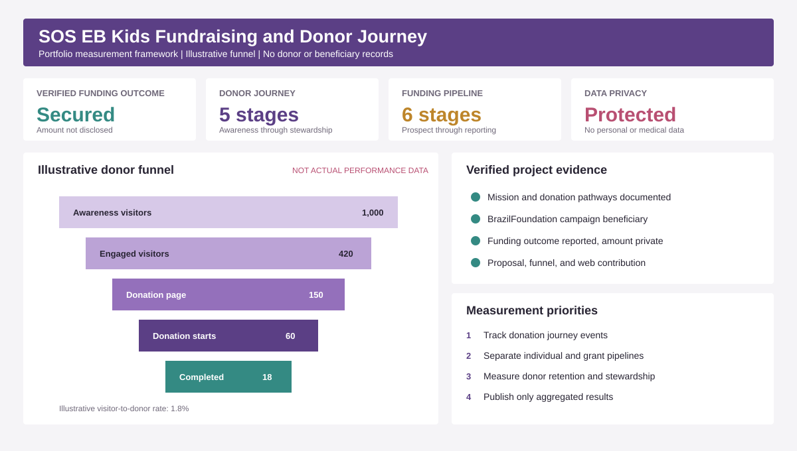

# SOS EB Kids Fundraising and Donor Journey Analytics

## Executive summary

This portfolio case study shows how I supported SOS EB Kids through fundraising strategy, proposal development, digital communications, and donor-journey design.

SOS EB Kids supports Brazilian children living with epidermolysis bullosa through material and emotional assistance, information, and awareness. My work included collaborating on a public-facing web page, organizing the fundraising story, creating a donor funnel, and contributing to a proposal connected with BrazilFoundation support.

No donor records, grant amounts, personal information, or internal financial data appear in this repository. The donor-funnel dataset is illustrative and exists only to demonstrate the measurement framework.



## Organization and public evidence

- [SOS EB Kids official website](https://www.sosebkids.org/) explains the mission, donation pathways, and support for children with EB.
- [BrazilFoundation fundraising campaign](https://brazilfoundation.org/en/event/arraia-100th-street/) identifies SOS EB Kids as a beneficiary and describes its mission.

## Business question

How should a small nonprofit connect awareness, trust, donor interest, and funding applications in one measurable fundraising system?

## My contribution

- Helped develop fundraising messaging and proposal materials
- Structured a donor and supporter funnel
- Worked with the team on web content in 2024
- Connected the mission, beneficiary need, and donor action
- Supported work that secured BrazilFoundation funding
- Translated nonprofit activity into measurable stages and reporting needs

## Verified outcomes and portfolio boundaries

| Item | Public or user-supported status | Portfolio treatment |
| --- | --- | --- |
| SOS EB Kids supports Brazilian children with EB | Publicly documented | Linked to official website |
| BrazilFoundation fundraising activity benefited SOS EB Kids | Publicly documented | Linked to BrazilFoundation page |
| BrazilFoundation funding was secured with my contribution | Professional experience reported by Gerusa Maso | No amount disclosed |
| Donor journey and proposal work | Professional experience reported by Gerusa Maso | Process documented without confidential files |
| Funnel counts and conversion rates | No verified raw dataset available | Illustrative data only |

## Fundraising system

### Awareness

Mission-led content explains EB, the daily needs of affected children, and the purpose of the organization.

### Interest

Visitors engage with stories, program information, events, email sign-up, and partner content.

### Trust

Financial documents, governance information, partnerships, and clear program descriptions reduce donor uncertainty.

### Action

Supporters donate, provide products, attend fundraising events, join the mailing list, or explore institutional funding.

### Stewardship

Acknowledgements, impact updates, and follow-up communication support retention and future giving.

## Illustrative funnel analysis

The sample data demonstrates how the nonprofit should measure movement between stages. These values do not represent actual SOS EB Kids performance.

| Stage | Illustrative count | Stage conversion |
| --- | ---: | ---: |
| Awareness page visitors | 1,000 | 100.0% |
| Engaged visitors | 420 | 42.0% |
| Donation-page visitors | 150 | 35.7% |
| Donation starts | 60 | 40.0% |
| Completed donations | 18 | 30.0% |

## Analytical lessons

### Mission reach is not fundraising success

Page traffic shows awareness. Completed donations and retained donors show fundraising performance. Both measures matter, but they answer different questions.

### Trust should be measured as a funnel stage

Visits to financial, governance, partner, and program pages indicate that prospective donors are evaluating credibility before acting.

### Grants and individual giving require different pipelines

Individual donors move through content, donation, and stewardship stages. Institutional funders move through prospect research, eligibility, proposal, review, award, and reporting.

### Missing data should shape the next action

Without reliable event tracking and donor identifiers, the team should improve measurement before claiming channel attribution or conversion impact.

## Recommended KPI framework

| Objective | KPI | Decision supported |
| --- | --- | --- |
| Build awareness | Mission-page visitors and video completion | Which stories attract attention? |
| Develop interest | Email sign-ups and repeat visits | Which audiences need follow-up? |
| Build trust | Governance and impact-page visits | Which proof points matter? |
| Generate support | Donation completion rate | Where does the donation journey lose people? |
| Retain donors | Repeat-donor rate | Which stewardship activity supports loyalty? |
| Secure grants | Proposal success rate and funding cycle time | Which funders and themes deserve priority? |

## Repository structure

```text
.
├── assets/
│   └── sos-eb-kids-fundraising-dashboard.svg
├── data/
│   ├── illustrative_donor_funnel.csv
│   ├── institutional_funding_pipeline.csv
│   └── verified_project_evidence.csv
├── docs/
│   ├── data_dictionary.md
│   └── measurement_plan.md
├── sql/
│   └── fundraising_analysis.sql
└── src/
    └── analyze.py
```

## Run the illustrative analysis

The script uses Python 3.10 or later and the standard library.

```bash
python src/analyze.py
```

## Skills demonstrated

- Digital fundraising strategy
- Donor journey mapping
- Grant and proposal support
- Funnel analysis
- KPI design
- Nonprofit website strategy
- Data ethics and privacy
- Stakeholder communication

## Data ethics

The repository contains no donor identities, beneficiary medical information, grant amounts, private proposals, or internal financial records. Illustrative values are labelled in every relevant file. The verified evidence table links public sources and distinguishes them from professional experience statements.

## Author

Gerusa Maso  
Business Analytics and Communications Professional  
Brussels, Belgium
