# UN Latin America Data Storytelling and Content Strategy

## Executive summary

This case study documents my 2024 data analytics and content strategy work for a UN-affiliated Latin community program in New York.

The 120-hour project connected research, Tableau visualization, data storytelling, content planning, publishing support, and engagement monitoring. The portfolio combines the official project scope with Tableau exports I produced during the assignment.

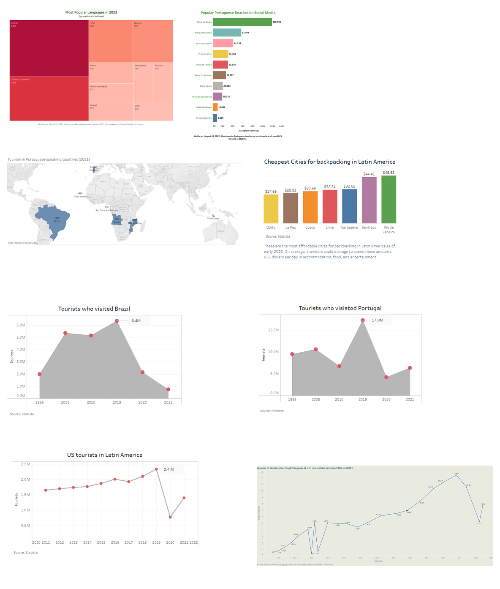

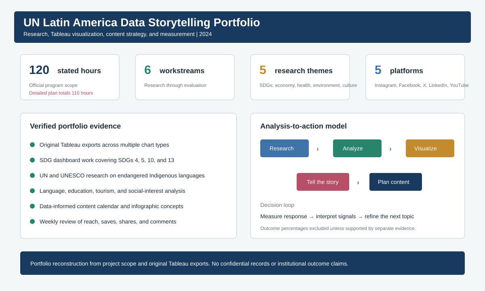

## My role

**Data Analytics Intern, Data Storytelling and Content Strategy | 2024**

My documented contributions included:

- Researching Latin American and Portuguese-language topics using credible public sources
- Building Tableau visualizations for research communication and content planning
- Developing an SDG dashboard using public UN data, with work covering SDGs 4, 5, 10, and 13
- Researching endangered Indigenous languages using UNESCO and UN public sources
- Translating findings into accessible narratives, infographics, and content ideas
- Supporting a data-informed content calendar
- Reviewing reach, saves, shares, and comments to inform future content
- Reporting findings and recommendations to the program director

## Research-to-content workflow

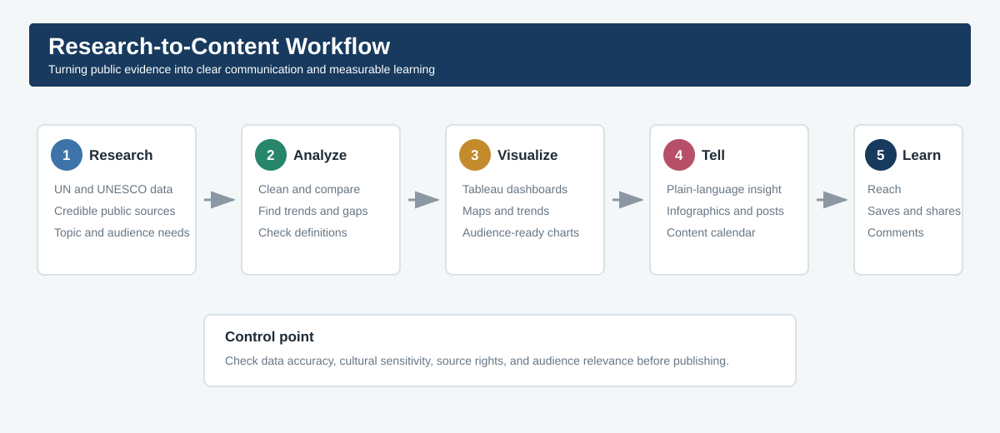

The workflow connected evidence to communication decisions: source research, data preparation, Tableau analysis, narrative development, content planning, and performance review.

## Tableau portfolio

These original Tableau exports show the range of research questions and visual formats explored during the assignment. Source citations are retained inside the images. Raw licensed data is not redistributed.

### Language and education research

#### Most popular languages in 2023

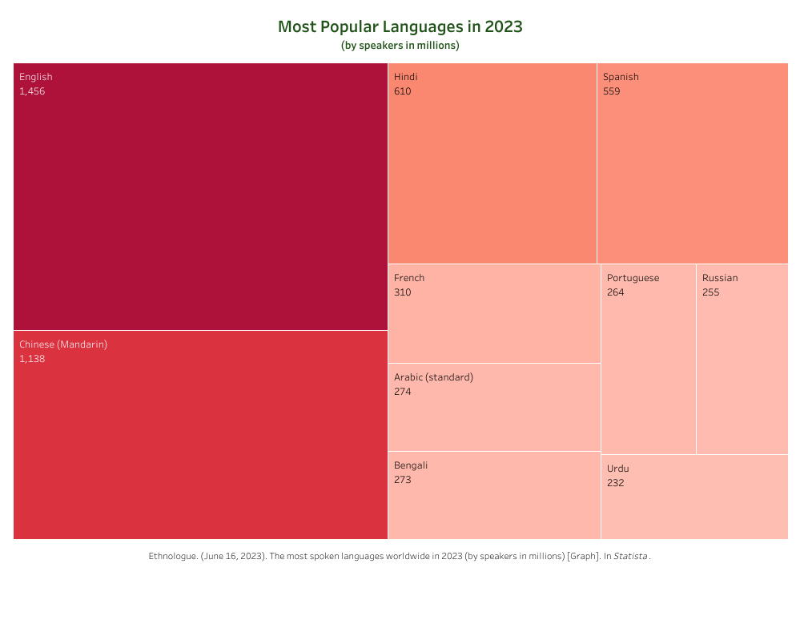

The treemap compares language scale while keeping the largest categories immediately visible.

#### Portuguese enrollment at U.S. universities

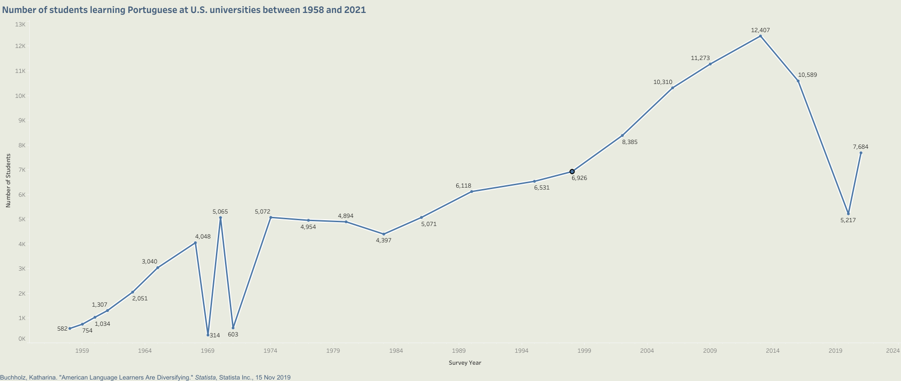

The time series highlights long-term growth, disruptions, and recent changes in Portuguese-language enrollment.

### Tourism and cultural-interest research

#### Tourism in Portuguese-speaking countries

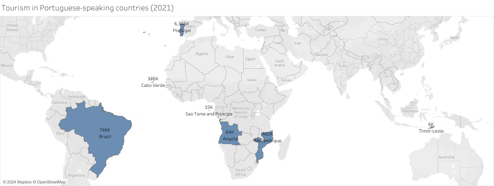

The map turns a cross-country comparison into a geographic story spanning Latin America, Europe, Africa, and Asia.

#### Tourism trends in Brazil and Portugal

| Brazil | Portugal |
| --- | --- |
| 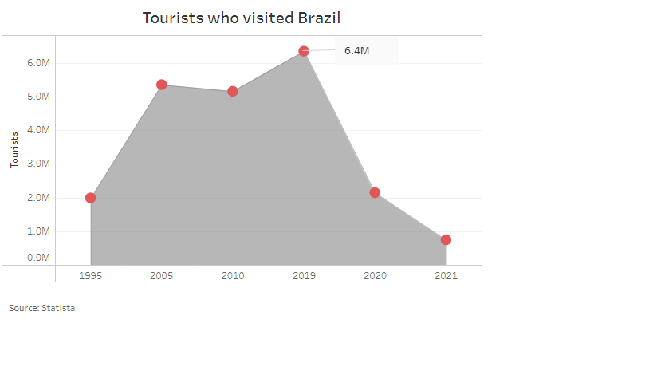 | 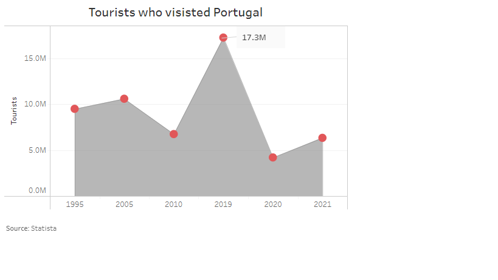 |

The paired time-series views support direct comparison of tourism trends and the sharp 2020 disruption.

#### U.S. tourism in Latin America

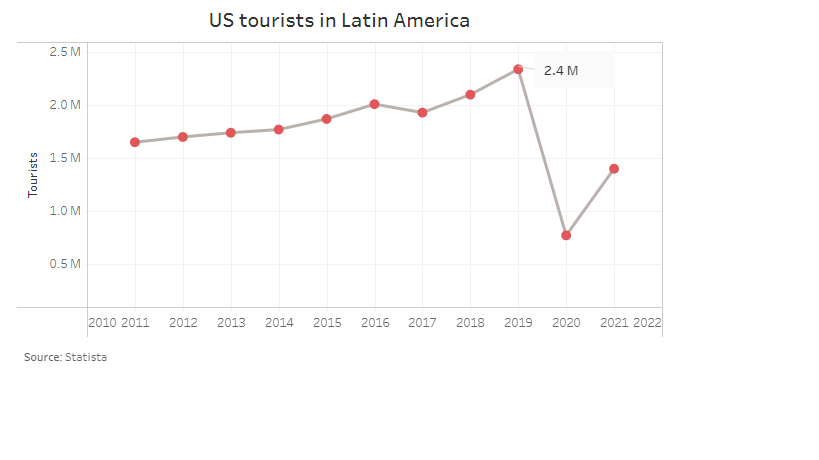

This view tracks the regional trend and makes the 2020 break in the series visible.

#### Affordable backpacking destinations

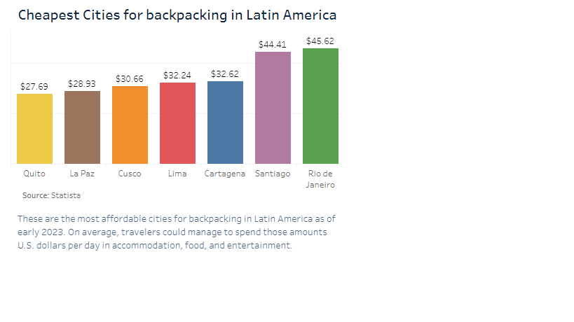

The ranked bar chart turns destination-cost research into a clear content angle for travel audiences.

#### Portuguese beaches on social media

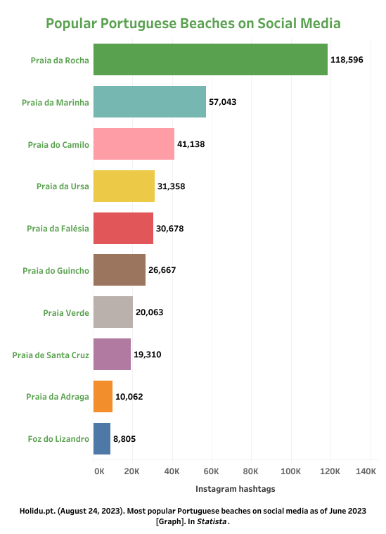

The chart uses social-media signals to compare destination visibility and audience interest.

## Documented project scope

| Workstream | Portfolio evidence |
| --- | --- |
| Research and data collection | Public-source research on language, tourism, SDGs, culture, and social inclusion |
| Data analysis and interpretation | Comparative analysis, trend review, geographic analysis, and source checking |
| Data visualization | Tableau treemap, maps, time series, ranked bars, and SDG dashboard work |
| Data storytelling | Plain-language narratives connecting findings with audience relevance |
| Content strategy | Topic selection, infographic concepts, and a data-informed content calendar |
| Monitoring and evaluation | Review of reach, saves, shares, comments, and feedback |

## Scope audit

The project brief states a total duration of 120 hours. Its six detailed workstream allocations add to 110 hours. I preserve both values and flag the 10-hour difference rather than silently changing the source.

Run the audit:

```bash
python src/audit_scope.py
```

This small check demonstrates source validation, transparent assumptions, and reproducible reporting.

## Skills demonstrated

- Tableau dashboard and visualization design
- Research and source evaluation
- Data cleaning and quality review
- Trend, comparison, and geographic analysis
- Data storytelling for nontechnical audiences
- Content strategy and editorial planning
- KPI definition and engagement monitoring
- Cross-functional reporting
- Responsible use of public and licensed sources

## Repository structure

```text
.
├── assets/
│   ├── project-evidence-dashboard.svg
│   ├── research-to-content-workflow.svg
│   ├── tableau-work-gallery.png
│   └── tableau/
│       └── eight original Tableau exports
├── data/
│   └── scope_workstreams.csv
├── docs/
│   └── evidence-and-limitations.md
├── src/
│   └── audit_scope.py
└── tests/
    └── test_audit_scope.py
```

## Evidence and limitations

- The portfolio includes original Tableau exports and a scope-based reconstruction of the project process.
- The original project brief is not published because it was created for internal program use.
- No confidential membership records, personal information, internal communications, or unpublished UN data appear here.
- No membership-growth or engagement-growth percentage is presented as a verified institutional result.
- Statista-derived visuals retain visible citations. Their underlying licensed datasets are not distributed.

More detail appears in [Evidence and limitations](docs/evidence-and-limitations.md).

## Author

Gerusa Maso  
Business Analytics and Communications Professional  
Brussels, Belgium
