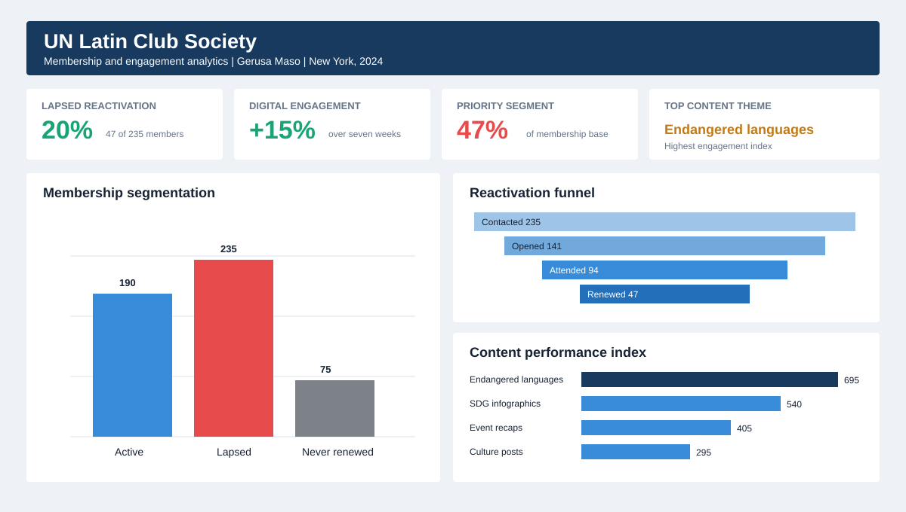

# UN Latin Club Membership and Engagement Analytics

## Executive summary

This portfolio case study shows how I translated membership and content data into a reactivation strategy for the United Nations Staff Recreation Council Latin Club Society in New York.

The analysis identified lapsed members as the highest-value audience, measured a simple reactivation funnel, and created a weekly feedback loop for content and event decisions. The public files use reconstructed, aggregated data because the original membership records are confidential.



## Business question

How should a membership organization identify people at risk of disengagement, bring former members back, and use content performance to guide its programming?

## My role

Data Research Analyst Intern, 2024

I worked on membership analysis, audience segmentation, dashboard reporting, content performance review, and research communication in a compliance-sensitive environment.

## What I built

- A membership audit separating active, lapsed, and never-renewed members
- A reactivation funnel covering outreach, email opens, event attendance, and renewal
- A weekly engagement reporting loop for leadership
- A content performance comparison across five editorial themes
- A dashboard linking metrics to decisions

## Results shown in the reconstructed case

| Metric | Result | Decision value |
| --- | ---: | --- |
| Lapsed member base | 235 people, 47% of records | Prioritize an audience with prior interest |
| Lapsed members renewed | 47 people | Demonstrates a 20% reactivation rate |
| Email open rate | 60% | Confirms message relevance at the awareness stage |
| Event attendance rate | 40% of contacted members | Shows movement from interest to participation |
| Digital engagement change | +15% over seven weeks | Supports a weekly test-and-learn process |
| Highest-performing theme | Endangered languages | Guides the next editorial and event topics |

## Analytical workflow

1. Audit membership records and define lifecycle segments.
2. Select lapsed members as the priority reactivation audience.
3. Track each stage of the outreach funnel.
4. Compare content themes with a consistent engagement index.
5. Review weekly performance with leadership.
6. Convert findings into event and editorial actions.

## Key insights

### Lapsed members were the best first audience

They had already expressed interest in the organization. Re-engaging this group required less education than acquiring new members.

### The funnel exposed the largest conversion loss

The reconstructed funnel moves from 235 contacted members to 141 email opens, 94 event attendees, and 47 renewals. The largest numerical drop occurs before the email open. Subject-line testing and personal invitations deserve early attention.

### Educational content led performance

The endangered languages series produced the highest engagement index. SDG infographics ranked second. Both formats translated complex research into concise, shareable content.

### A reporting rhythm mattered more than one campaign

Weekly review created a repeatable loop: measure, interpret, decide, publish, and measure again.

## Metric definition lesson

Clear denominators protect analytical credibility. The public dashboard describes a 20% result. In this reconstructed dataset, 47 renewed members divided by 235 lapsed members equals a 20% reactivation rate. Adding those 47 renewals to 190 active members would represent a 24.7% increase in the active base. The repository reports both calculations and names each denominator.

## Repository structure

```text
.
├── assets/
│   └── un-membership-dashboard.png
├── data/
│   ├── content_performance.csv
│   ├── membership_segments.csv
│   ├── reactivation_funnel.csv
│   └── weekly_engagement.csv
├── docs/
│   ├── data_dictionary.md
│   └── methodology.md
├── sql/
│   └── membership_analysis.sql
└── src/
    └── analyze.py
```

## Run the analysis

Python 3.10 or later is sufficient. The script uses the standard library only.

```bash
python src/analyze.py
```

The script checks the totals and prints the headline metrics used in this case study.

## Skills demonstrated

- Data cleaning and metric definition
- Customer lifecycle segmentation
- Funnel analysis
- Content performance analysis
- Dashboard design
- Stakeholder reporting
- Data privacy and responsible portfolio presentation
- Business storytelling with quantitative evidence

## What another analyst can reuse

- Define each segment before calculating results.
- Show the denominator beside every percentage.
- Track conversion between stages, not only final outcomes.
- Compare content using one metric definition across all themes.
- End every finding with a decision or test.
- Replace confidential records with aggregated or synthetic examples in public work.

## Data ethics

No personal information or internal UN records appear in this repository. The datasets recreate the structure and headline figures shown in the portfolio dashboard. They exist for demonstration and learning, not institutional reporting.

## Author

Gerusa Souza<br>
Business Analytics and Communications Professional<br>
Brussels, Belgium
