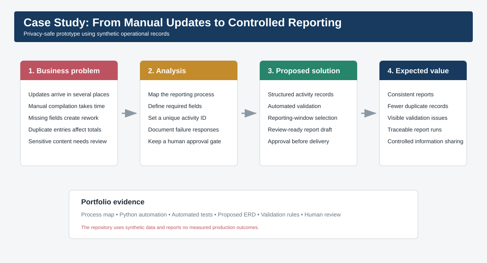
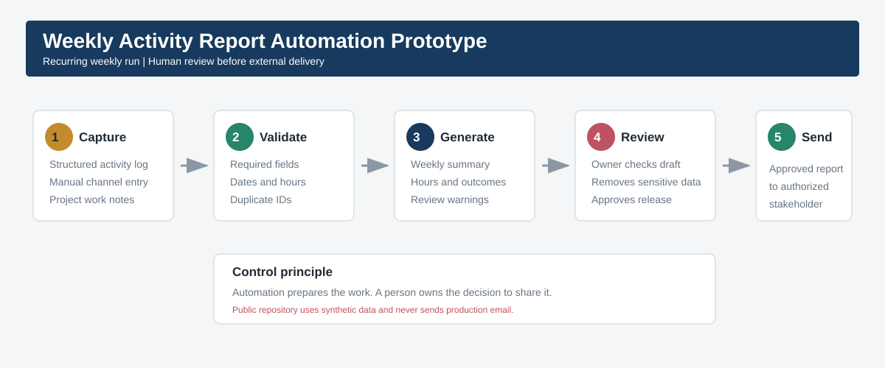
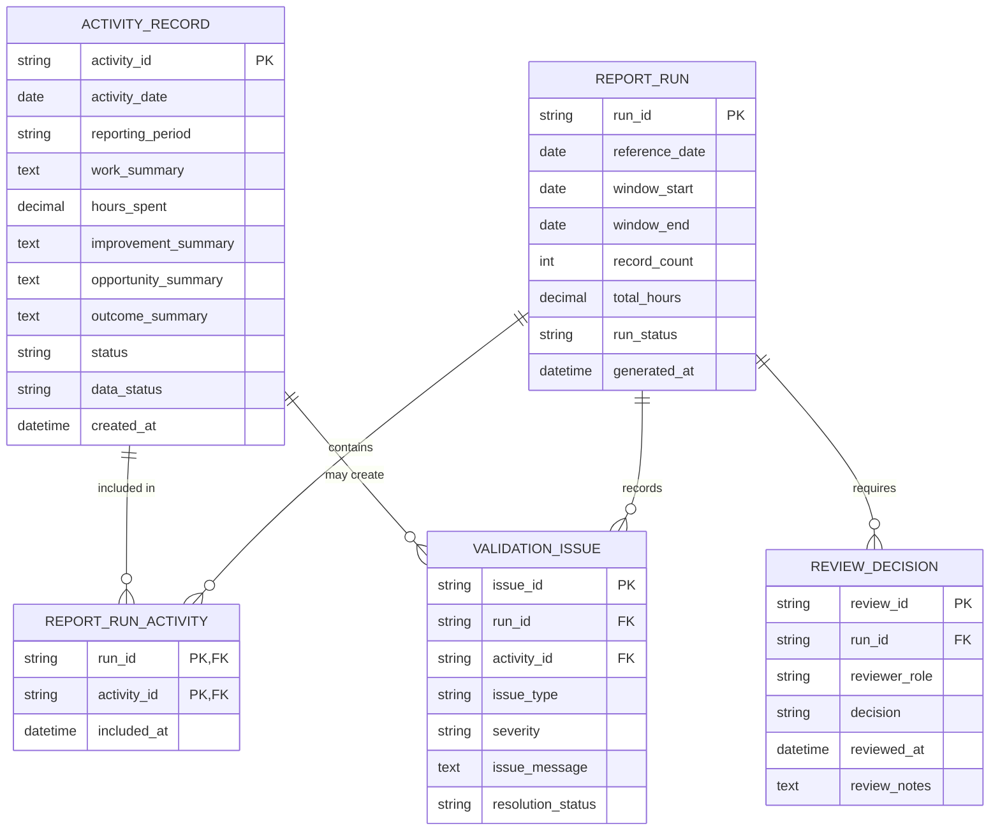

# Weekly Activity Report Automation Prototype

## Executive summary

This portfolio case study demonstrates a reusable weekly reporting automation for teams that track operational activities.

The workflow turns structured activity logs into a concise weekly report. It reduces manual compilation while preserving a human approval step before external delivery.

The implementation uses synthetic records and a local CSV export. It contains no credentials, email addresses, internal messages, or confidential work records.

## Case study at a glance



The case follows a business-analysis sequence: identify the reporting problem, map requirements and controls, build a privacy-safe prototype, and define the measures needed for a future deployment. Expected value is presented as a design objective because the public prototype does not claim measured production results.

## Proposed workflow



## Proposed data model

The public prototype reads a CSV export. The following ERD presents the normalized logical model proposed for a database-backed version. It is a design artifact, not a claim that these tables are deployed in production.



The model separates operational records, automation runs, validation findings, and human approval. This supports traceability, duplicate prevention, controlled review, and future reporting without storing personal data in the public example. See [Proposed data model](docs/proposed-data-model.md) for the design rationale and field rules.

## Business problem

Operational updates can arrive through several communication channels. Preparing a weekly summary requires reviewing updates, organizing completed work, recording hours, identifying improvements, and describing possible outcomes.

The reporting process needed one reliable source of truth and a consistent review cycle.

## Documented workflow

The prototype defines this process:

1. Work is recorded in a structured weekly log.
2. Updates from unsupported channels are added manually.
3. A scheduled process compiles the weekly entries.
4. The draft report goes to the workflow owner for review.
5. The owner approves the content before external delivery.

The approval step prevents incomplete, inaccurate, or sensitive information from being sent automatically.

## Weekly log fields

| Field | Purpose |
| --- | --- |
| Week | Human-readable reporting period |
| Week Of | Date used for filtering and scheduling |
| Work Done | Completed activities |
| Hours Spent | Time recorded for each activity |
| Improvements Made | Process or quality improvements |
| Ideas and Opportunities | Future automation or analysis ideas |
| Possible Outcomes | Expected organizational value |
| Status | Logged, Needs Review, or Approved |

## Public reference implementation

The Python script demonstrates the safe core of the automation:

- Reads a Weekly Log CSV export
- Validates required fields
- Selects records for a reporting window
- Flags records marked Needs Review
- Totals numeric hours
- Generates a Markdown email draft
- Creates a run identifier for audit tracking
- Stops without sending any external message

```bash
python src/build_weekly_report.py \
  --input data/sample_weekly_log.csv \
  --reference-date 2026-09-11 \
  --output output/weekly_report.md
```

## Controls

- Human review before external delivery
- Manual capture of updates from unsupported channels
- Required-field validation
- Duplicate prevention with week and activity identifiers
- Synthetic public test data
- No credentials stored in the repository
- No automated production email in the public version

## Failure handling

| Failure | Response |
| --- | --- |
| Missing required field | Stop and list the missing field |
| Invalid date | Stop and identify the affected record |
| Invalid hours | Flag the record and exclude it from the total |
| Duplicate activity ID | Stop to prevent double counting |
| Needs Review status | Include a visible warning in the report |
| Empty reporting period | Generate a no-activity draft for human review |
| Email delivery failure | Keep the report file and notify the workflow owner |

## Success measures

This prototype does not claim measured time savings. A deployed workflow should track:

- Minutes required to prepare the weekly report
- Percentage of weekly activities logged before the reporting deadline
- Number of records requiring correction
- Number of duplicate entries prevented
- Report delivery timeliness
- Manual interventions per run

## Repository structure

```text
.
├── assets/
│   ├── case-study-overview.svg
│   └── weekly-report-workflow.svg
├── data/
│   └── sample_weekly_log.csv
├── docs/
│   ├── deployment-guide.md
│   ├── proposed-data-model.md
│   └── workflow-specification.md
├── src/
│   └── build_weekly_report.py
├── templates/
│   └── report-email.md
└── tests/
    └── test_build_weekly_report.py
```

## Skills demonstrated

- Workflow analysis
- Requirements gathering
- Process mapping
- Relational data modeling
- Python automation
- Data validation
- Exception handling
- Human-in-the-loop design
- Audit and privacy controls
- Business reporting

## Data ethics

The repository contains only synthetic activity records. It excludes real messages, employee information, credentials, addresses, schedules, recipient names, and internal work details.

## Author

Portfolio Author  
Business Analytics and Process Automation Portfolio
